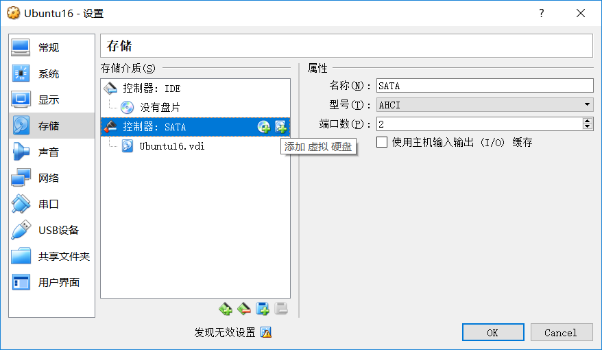
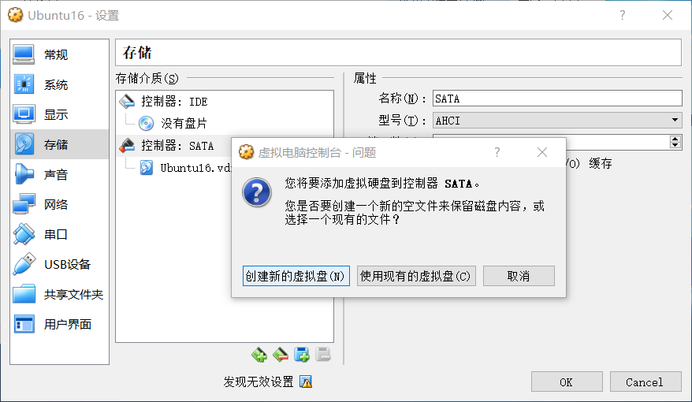
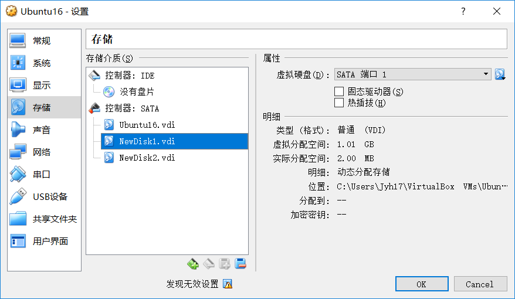
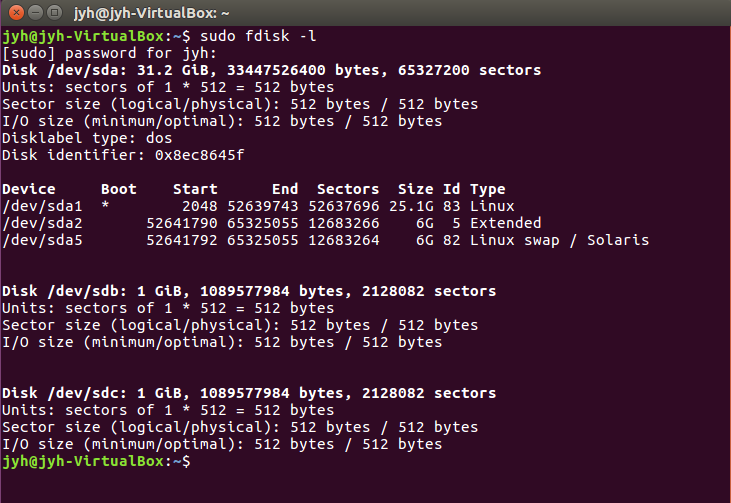
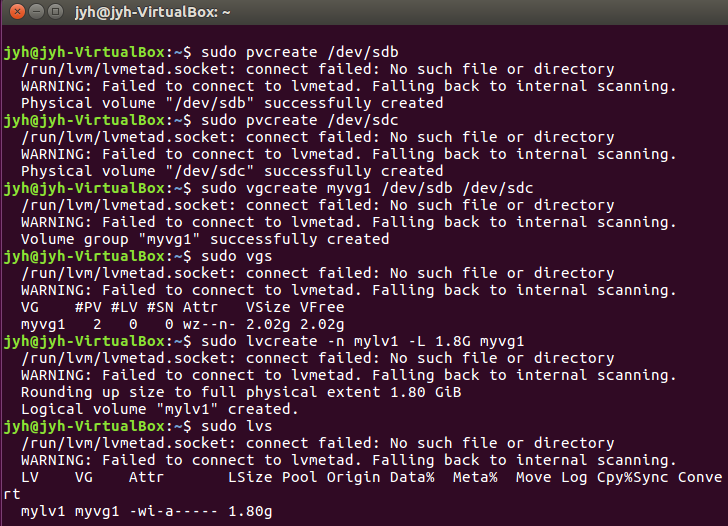
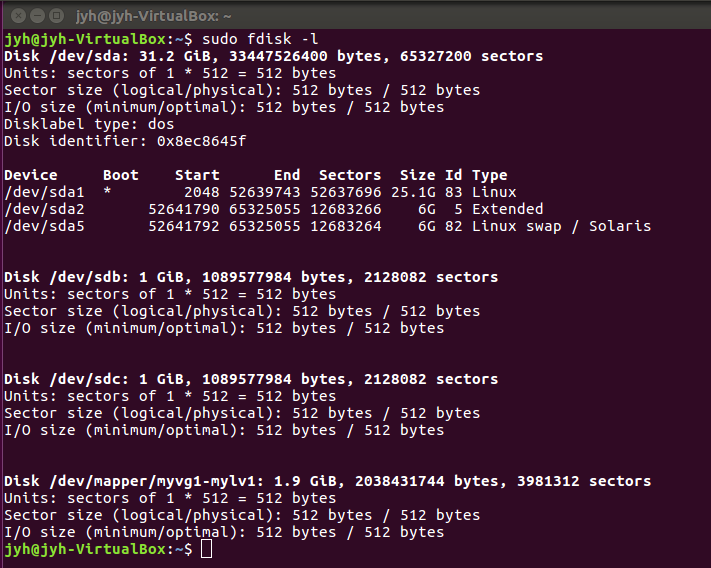
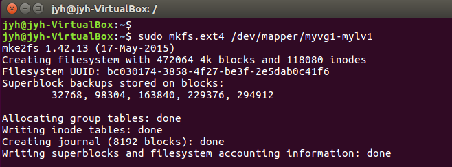
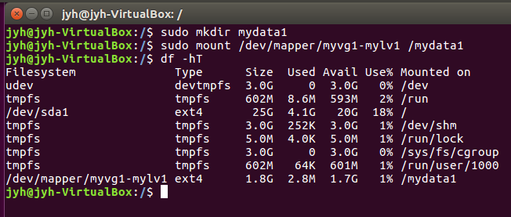
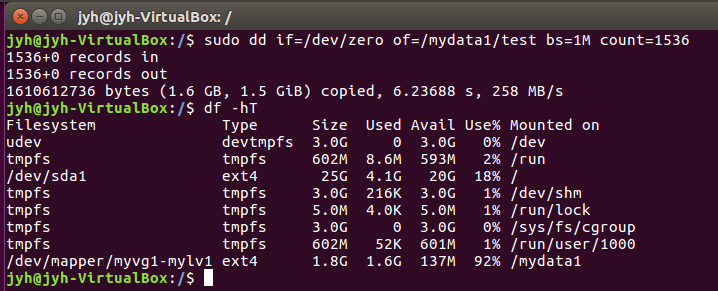
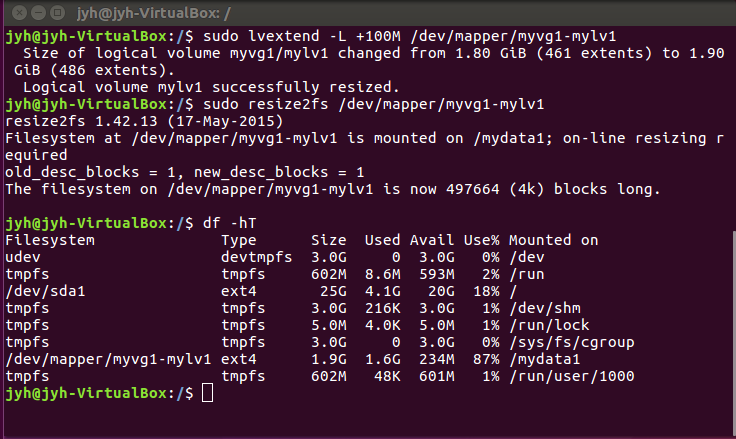

## <center>**LVM使用教程**</center>
author : jyh
### **概述**

LVM (Logical Volume Manager / 逻辑卷管理)，是Linux环境下对磁盘分区进行管理的一种机制 \
我们采用这项技术，以便对实验室服务器的磁盘空间进行更有效的管理

### **注意事项**

1. 使用lvm可以在安装Ubuntu16系统的时候勾选对应选项
2. 若安装Ubuntu系统时未选择lvm选项，可以使用`sudo apt-get install lvm2`命令安装lvm工具； \
但是想要对挂载在根目录下的磁盘分区使用lvm管理会比较困难，尽量不要尝试，对应教程如下： \
将根目录转移至lvm卷教程：http://os.51cto.com/art/201608/516672.htm


### <center>**在未选择lvm选项情况下使用lvm**<center>

###  **实验环境**
VirtualBox虚拟机上运行Ubuntu16系统（安装时未勾选lvm选项
）

### **实验步骤**

####  **添加两块硬盘**

由于在虚拟机下，只需要在设置里添加就行





进入系统执行
```shell
sudo fdisk -l
```
会发现新添加的两块硬盘已经挂载上了，在实际情况中需要自己去挂载新硬盘，参考教程 https://github.com/GraphXLab/DBA/blob/master/Linux%E4%B8%8B%E6%8C%82%E8%BD%BD%E6%96%B0%E7%A1%AC%E7%9B%98.pdf



#### **安装lvm工具**

```shell
sudo apt-get install lvm2
```

####  **lvm基本操作**

```shell
# 对两个新增的硬盘创建物理卷
sudo pvcreate /dev/sdb
sudo pvcreate /dev/sdc
# 在两个物理卷基础上创建卷组，并查看创建的卷组，大小为2G
sudo vgcreate myvg1 /dev/sdb /dev/sdc
sudo vgs
# 在卷组myvg1上创建大小为1.8G的逻辑卷，并查看创建的逻辑卷
sudo lvcreate -n mylv1 -L 1.8G myvg1
sudo lvs
```



####  **逻辑卷初始化文件系统**

逻辑卷地址需要用`sudo fdisk -l`去查询，而不是直接用逻辑卷的名字
```shell
sudo fdisk -l
sudo mkfs.ext4 /dev/mapper/myvg1-mylv1
```





####  **挂载逻辑卷**

```shell
cd /
sudo mkdir mydata1
sudo mount /dev/mapper/myvg1-mylv1 /mydata1
df -hT
```
以上方法在重启电脑后需要重新挂载，可以修改/etc/fstab文件直接把挂载内容写进去 \
参考教程 https://github.com/GraphXLab/DBA/blob/master/Linux%E4%B8%8B%E6%8C%82%E8%BD%BD%E6%96%B0%E7%A1%AC%E7%9B%98.pdf



#### **测试逻辑卷**

利用dd命令在逻辑卷中生成1.5G文件，如果系统不报错，则逻辑卷没有问题
```shell
sudo dd if-/dev/zero of=/mydata1/test bs=1M count=1536
df -hT
```



#### **拓展逻辑卷**

```shell
sudo lvextend -L +100M /dev/mapper/myvg1-mylv1
# 刷新文件系统
sudo resize2fs /dev/mapper/myvg1-mylv1
df -hT
```



卷组也可以拓展，新增物理卷即可

缩小逻辑卷要格外小心，操作不当可能造成文件丢失甚至文件系统损坏，具体操作在参考资料中，进行此操作时一定要记得先备份文件

### **参考资料**
1. https://www.cnblogs.com/linuxprobe/p/5381538.html
